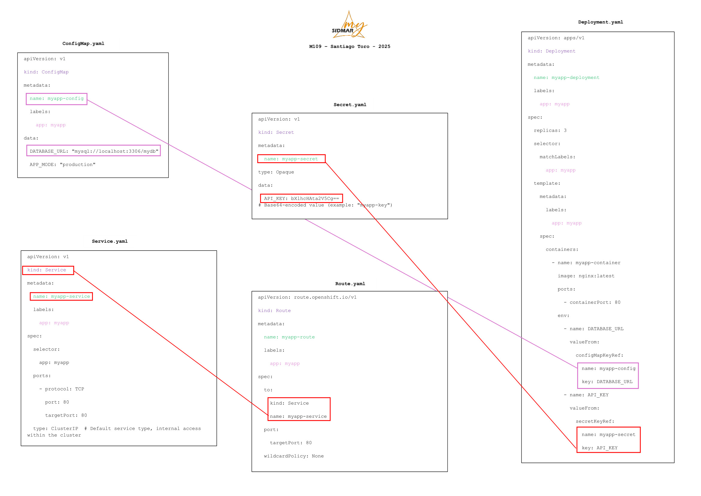

# Kubernetes und OpenShift Konfigurationen

In diesem Dokument wird erläutert, wie du Kubernetes-Ressourcen wie **Deployment**, **Service**, **ConfigMap**, **Secrets**, **Routes** und deren Interaktionen mit Labels konfigurierst. Zudem beschreiben wir, wie man die Konfigurationen mit dem **OpenShift CLI (oc)** umsetzt. 🚀



## 1. Deployment

Ein Kubernetes **Deployment** stellt sicher, dass eine bestimmte Anzahl von Pods gleichzeitig ausgeführt wird und ermöglicht einfache Rollouts und Skalierungen.

**Beispiel YAML für ein Deployment**:
```yaml
apiVersion: apps/v1
kind: Deployment
metadata:
  name: myapp-deployment
  labels:
    app: myapp
spec:
  replicas: 3
  selector:
    matchLabels:
      app: myapp
  template:
    metadata:
      labels:
        app: myapp
    spec:
      containers:
      - name: myapp-container
        image: myapp-image:latest
        ports:
        - containerPort: 8080
```

### Wichtige Punkte:
- **apiVersion**: Gibt die API-Version der Ressource an, hier `apps/v1`.
- **kind**: Der Typ der Ressource, in diesem Fall `Deployment`.
- **metadata.name**: Der Name des Deployments.
- **metadata.labels**: Labels zur Identifikation und Gruppierung von Ressourcen.
- **spec.replicas**: Anzahl der Pods, die du laufen lassen möchtest.
- **spec.selector.matchLabels**: Der Selector zum Verwalten von Pods.
- **spec.template.metadata.labels**: Labels zur Identifikation der zugehörigen Pods.

## 2. Service

Ein **Service** ermöglicht den Zugriff auf Pods, die von einem Deployment verwaltet werden.

**Beispiel YAML für einen Service**:
```yaml
apiVersion: v1
kind: Service
metadata:
  name: myapp-service
  labels:
    app: myapp
spec:
  selector:
    app: myapp
  ports:
    - protocol: TCP
      port: 80
      targetPort: 8080
  type: ClusterIP
```

### Wichtige Punkte:
- **spec.selector**: Labels des Deployments oder Pods, die vom Service angesprochen werden.
- **spec.ports**: Die externen Ports, über die der Service erreichbar ist, sowie der interne `targetPort` der Pods.
- **spec.type**: Der Typ des Services, z.B. `ClusterIP`, `NodePort`, oder `LoadBalancer`.

## 3. ConfigMap

**ConfigMaps** speichern Konfigurationsdaten, die von Pods zur Laufzeit verwendet werden können.

**Beispiel YAML für eine ConfigMap**:
```yaml
apiVersion: v1
kind: ConfigMap
metadata:
  name: myapp-config
  labels:
    app: myapp
data:
  DATABASE_URL: "mongodb://localhost:27017"
  APP_MODE: "production"
```

## 4. Secrets

**Secrets** speichern vertrauliche Informationen wie Passwörter oder Tokens.

**Beispiel YAML für ein Secret**:
```yaml
apiVersion: v1
kind: Secret
metadata:
  name: myapp-secret
  labels:
    app: myapp
type: Opaque
data:
  DB_PASSWORD: cGFzc3dvcmQ=  # Base64-encoded password
```

### Wichtige Punkte:
- **data**: Daten müssen **Base64-kodiert** gespeichert werden.
- **type**: Der Standardtyp für Secrets ist `Opaque`.

## 5. Routes (für OpenShift)

In OpenShift können **Routes** verwendet werden, um einen externen Zugriff auf Services innerhalb eines Clusters zu ermöglichen. Sie bieten eine Möglichkeit, den Traffic von aussen zu den Pods weiterzuleiten.

**Beispiel YAML für eine Route**:
```yaml
apiVersion: route.openshift.io/v1
kind: Route
metadata:
  name: myapp-route
  labels:
    app: myapp
spec:
  host: myapp.example.com  # Externe URL
  to:
    kind: Service
    name: myapp-service
  port:
    targetPort: 8080
```

### Wichtige Punkte:
- **spec.host**: Die externe URL, unter der die Anwendung erreichbar sein wird.
- **spec.to.name**: Der Name des Services, auf den die Route verweist.
- **spec.port.targetPort**: Der Port, auf den die Route zugreifen wird (entsprechend dem `targetPort` im Service).

## 6. OpenShift CLI (`oc`) Befehle

Mit dem OpenShift CLI (`oc`) kannst du die oben beschriebenen Ressourcen verwalten. Hier sind einige grundlegende Befehle:

### 1. Deployment erstellen:
```bash
oc apply -f deployment.yaml
```

### 2. Service erstellen:
```bash
oc apply -f service.yaml
```

### 3. ConfigMap erstellen:
```bash
oc apply -f configmap.yaml
```

### 4. Secret erstellen:
```bash
oc apply -f secret.yaml
```

### 5. Route erstellen:
```bash
oc apply -f route.yaml
```

## 7. Labels und Kommunikation zwischen Ressourcen

Labels sind nützlich, um Ressourcen zu gruppieren und zu filtern. Sie spielen eine wichtige Rolle in der Kommunikation zwischen den verschiedenen Kubernetes-Ressourcen. Ein **Deployment** könnte beispielsweise Pods mit bestimmten Labels ausstatten, und ein **Service** könnte über diese Labels auf die Pods zugreifen.

**Beispiel für die Verwendung von Labels in einem Deployment und Service**:

**Deployment mit Label**:
```yaml
apiVersion: apps/v1
kind: Deployment
metadata:
  name: myapp-deployment
  labels:
    app: myapp
spec:
  replicas: 3
  selector:
    matchLabels:
      app: myapp
  template:
    metadata:
      labels:
        app: myapp
    spec:
      containers:
      - name: myapp-container
        image: myapp-image:latest
        ports:
        - containerPort: 8080
```

**Service, der über Labels mit Pods kommuniziert**:
```yaml
apiVersion: v1
kind: Service
metadata:
  name: myapp-service
  labels:
    app: myapp
spec:
  selector:
    app: myapp
  ports:
    - protocol: TCP
      port: 80
      targetPort: 8080
```

## 8. Zusammenfassung

- **Deployment**: Verwaltet die Anzahl der laufenden Pods und sorgt für Rollouts.
- **Service**: Ermöglicht den Zugriff auf Pods über definierte Ports.
- **ConfigMap**: Speichert Konfigurationsdaten für Pods.
- **Secret**: Speichert vertrauliche Informationen.
- **Route**: Ermöglicht externen Zugriff auf Services in OpenShift.
- **Labels**: Werden verwendet, um Ressourcen zu gruppieren und zu filtern, um die Kommunikation zwischen Pods, Deployments und Services zu ermöglichen.

Mit dieser grundlegenden Übersicht und den Beispielen kannst du Kubernetes-Ressourcen in einem Cluster erstellen und verwalten. Nutze das OpenShift CLI, um diese Ressourcen schnell zu implementieren! 🚀
